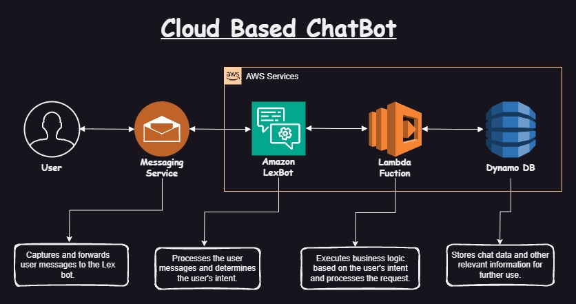

<h1>Banking_ChatBot</h1>
<h2>Overview</h2>

    Banking_ChatBot is an intelligent chatbot designed to assist with common banking tasks such as creating accounts, transferring funds, withdrawing money, and checking account balances. This project utilizes Amazon Lex for natural language understanding, AWS Lambda for executing business logic, and DynamoDB for data storage.

<h2>Features</h2>
<ul>
    <li><strong>Create Account</strong>: Allows users to create new banking accounts seamlessly.</li>
    <li><strong>Fund Transfer</strong>: Facilitates the transfer of funds between accounts.</li>
    <li><strong>Withdraw</strong>: Enables users to withdraw money from their accounts.</li>
    <li><strong>Check Balance</strong>: Provides users with the ability to check their account balances.</li>
</ul>
<h2>Technologies Used</h2>
<ul>
    <li><strong>Amazon Lex</strong>: For building the conversational interface of the chatbot.</li>
    <li><strong>AWS Lambda</strong>: To handle backend logic and integrations.</li>
    <li><strong>DynamoDB</strong>: To store user data and transaction records.</li>
</ul>
<h2>Getting Started</h2>

    To set up and deploy the Banking_ChatBot, follow these steps:

<h3>Prerequisites</h3>
<ul>
    <li>An AWS account</li>
    <li>AWS CLI installed and configured</li>
    <li>Python 3.x installed</li>
</ul>
<h3>Setup</h3>
<ol>
    <li>Create an IAM role:
        <ul>
            <li>Go to the IAM console in AWS.</li>
            <li>Create a new role with the service <strong>Lambda</strong>.</li>
            <li>Attach policies for full access to <strong>DynamoDB</strong>, <strong>Lambda</strong>, and <strong>CloudFront</strong>.</li>
        </ul>
    </li>
    <li>Clone the repository:
        <pre><code>git clone https://github.com/yourusername/Banking_ChatBot.git</code></pre>
    </li>
    <li>Navigate to the project directory:
        <pre><code>cd Banking_ChatBot</code></pre>
    </li>
    <li>Deploy AWS Lambda functions:
        <ul>
            <li>Create a deployment package for each Lambda function:
                <pre><code>zip create_account_bank.zip create_account_bank.py</code></pre>
                <pre><code>zip fund-tranfer.zip fund-tranfer.py</code></pre>
                <pre><code>zip withdraw.zip withdraw.py</code></pre>
                <pre><code>zip BalanceEnquiryfunction.zip BalanceEnquiryfunction.py</code></pre>
            </li>
            <li>Deploy the packages to AWS Lambda:
                <pre><code>aws lambda create-function --function-name create_account_bank --zip-file fileb://create_account_bank.zip --handler create_account_bank.lambda_handler --runtime python3.8 --role arn:aws:iam::your-account-id:role/your-lambda-role</code></pre>
                <pre><code>aws lambda create-function --function-name fund_tranfer --zip-file fileb://fund-tranfer.zip --handler fund_tranfer.lambda_handler --runtime python3.8 --role arn:aws:iam::your-account-id:role/your-lambda-role</code></pre>
                <pre><code>aws lambda create-function --function-name withdraw --zip-file fileb://withdraw.zip --handler withdraw.lambda_handler --runtime python3.8 --role arn:aws:iam::your-account-id:role/your-lambda-role</code></pre>
                <pre><code>aws lambda create-function --function-name BalanceEnquiryfunction --zip-file fileb://BalanceEnquiryfunction.zip --handler BalanceEnquiryfunction.lambda_handler --runtime python3.8 --role arn:aws:iam::your-account-id:role/your-lambda-role</code></pre>
            </li>
        </ul>
    </li>
     <li>Set up DynamoDB tables:
        <ul>
            <li>Create a table named <strong>customerdetails</strong> with <strong>accountnumber</strong> as the primary key (String type).</li>
            <li>Update the table name in all Lambda functions if necessary.</li>
        </ul>
    </li>
    <li>Create and configure Amazon Lex bot:
        <ul>
            <li>Navigate to the Amazon Lex console.</li>
            <li>Create a new bot and import the intents from the provided <code>Banking_ChatBot_Export.json</code> file.</li>
            <li>Link the bot with the corresponding Lambda functions.</li>
        </ul>
    </li>
</ol>
<h2>Usage</h2>

    Once the bot is set up, you can interact with it via the Amazon Lex console or integrate it into your applications to start managing banking tasks through conversations.

<h2>Repository Structure</h2>
<ul>
    <li><code>create_account_bank.py</code>: Lambda function to handle account creation.</li>
    <li><code>fund-tranfer.py</code>: Lambda function to handle fund transfers.</li>
    <li><code>withdraw.py</code>: Lambda function to handle withdrawals.</li>
    <li><code>BalanceEnquiryfunction.py</code>: Lambda function to handle balance checks.</li>
    <li><code>Banking_ChatBot_Export.json</code>: JSON file to configure the Lex bot with necessary intents.</li>
    <li><code>Architecture.jpg</code>: Architectural diagram of the Banking_ChatBot.</li>
</ul>
<h2>Note</h2>

    For simplicity, each banking task is handled by a separate Lambda function. However, it is possible to combine these into a single function if preferred.

