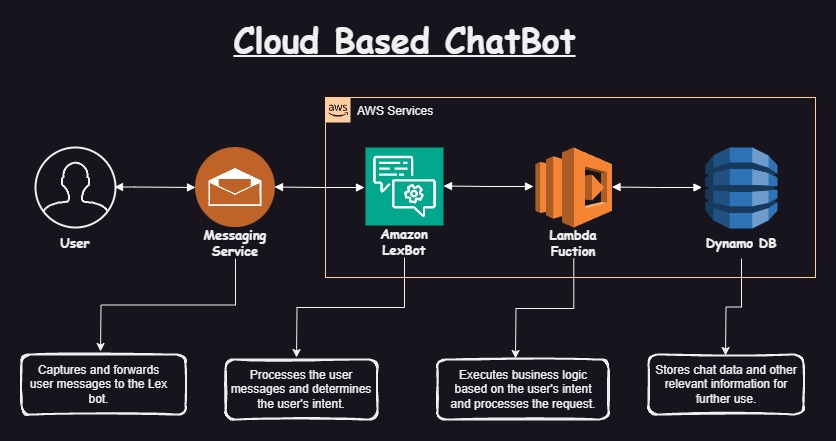

<h1>Banking_ChatBot</h1>

<h2>Overview</h2>

    Banking_ChatBot is an intelligent chatbot designed to assist with common banking tasks such as creating accounts, transferring funds, withdrawing money, and checking account balances. This project utilizes Amazon Lex for natural language understanding, AWS Lambda for executing business logic, and DynamoDB for data storage.

<h2>Features</h2>
<ul>
    <li><strong>Create Account</strong>: Allows users to create new banking accounts seamlessly.</li>
    <li><strong>Fund Transfer</strong>: Facilitates the transfer of funds between accounts.</li>
    <li><strong>Withdraw</strong>: Enables users to withdraw money from their accounts.</li>
    <li><strong>Check Balance</strong>: Provides users with the ability to check their account balances.</li>
</ul>

<h2>Technologies Used</h2>
<ul>
    <li><strong>Amazon Lex</strong>: For building the conversational interface of the chatbot.</li>
    <li><strong>AWS Lambda</strong>: To handle backend logic and integrations.</li>
    <li><strong>DynamoDB</strong>: To store user data and transaction records.</li>
</ul>
